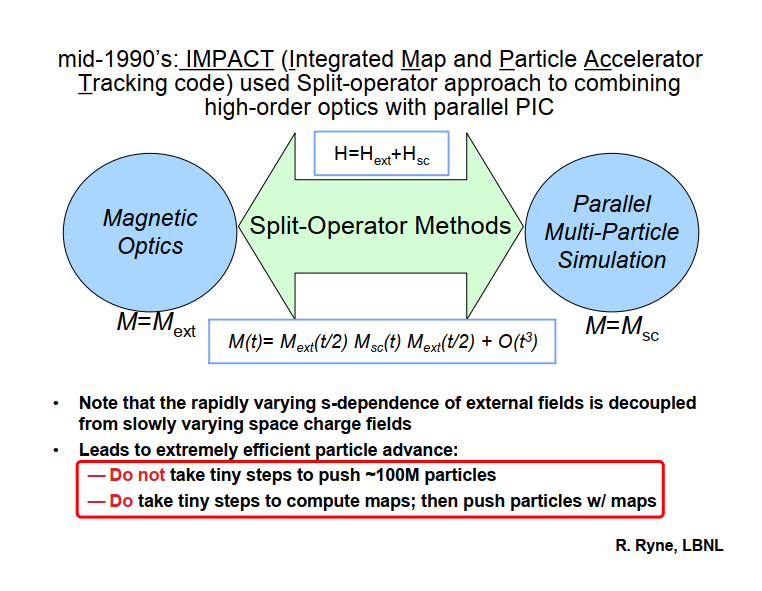

# chap1 功能需求

- [x] 赋值功能

- [x]  default order in control section should control all settings in lattice, lower priority than ORDER in each element.

- [x]  total_charge=0, turn off space charge.

- [x]  add a charge=1.0/-1.0 parameter. 

- [x] how to keep charge and current when space charge is off.

- [x]  rpn expression in lattice section is not supported yet.

- [ ] elegant2impactz.py

   read in elegant .lte type lattice, convert it to ImpactZ.in.

- [ ] 2022-03-02, manual 中的 Fortran level 可能有误，是以前很久的版本，规整到了当前版本的manual中。未查验。

- [ ] muzpz 不能用作二次弯曲项，代码中删除该部分代码。该功能可用 EMATRIX 替代。


# Chap2 代码框架及习惯

## Code Structure

- lattice_parser
- impactz_parser : lattice_parser
  - get_lattice_section
  - get_beam_section
  - get_control_section
- genimpactzin


### lattice_parser

programing notes

- `N*FODO` case, how to expand it ?

  ```python
  #like, expand line=['4*FODO','BC1'] to ['FODO','FODO','FODO','FODO','BC1']
  
  line=['4*FODO','BC1']
  
  tmpline = []
  for item in line:
      if re.match(r'^\d+\*',item):    # 4*FODO case
          tmp = item.split('*')
          tmpline.extend( int(tmp[0]) * [tmp[1]])
  
      elif re.match(r'^[a-zA-Z]+\*',item):  # FODO*4 case
          tmp = item.split('*')
          tmpline.extend( int( tmp[1]) * [tmp[0]] )
          print('ATTENTION: If in Elegant, you should use N*FODO, not FODO*N in .lte file.')
  
      else:
          tmpline.append(item)
  line = tmpline
  ```


解析字符串型输入文件。

### impactz_parser

Right now, only add those parameters I used mostly and understood well. ==DO NOT add the parameters I have not tested yet.==


Code design methods:

-  If not in dict keys list, then set default values
-  not case sensitive, use upper to match element or parameters name


## 使用语法

- `!` starts comments, comments following `!` are ignored.


- `&` 换行符

  ```bash
  D1: drift, &
      L=100   !comments here
  
  B1: Bend, angle=1.0, CSR=1, &  !comments here
      order=2
  ```

  ==First line is legal, fourth line is not legal.== `&` should be followed with `\n` character.

  

- element and line name should start with \[a-zA-Z]\[_]\[0-9]


- nested feature is surported

  ```
  D1: drift, &   ! comments here
  L=1.0
  
  B1: Bend,, angle="1.0"
  B2: Bend, angle=1.0
  B3: Bend, angle=1.0
  B4: Bend, angle=1.0
  
  BC: line=(B1,B2,B3,B4)
  
  BC-2: line=(2*BC)
  
  useline: line=(D1,2*BC-2)
  ```

- `,` and `;` are both supported in `beam` and `control` sections

  like:

  ```
  &beam
  	mass = 0.511;
  	Np = 1000;
  	charge = 1.0e-12;
  	sigx   = 0.1e-3,	sigxp  = 1.0e-3;  sigxxp = 0.0;	
  	sigy   = 0.1e-3;  sigyp  = 1.0e-3,  sigyyp= 0.0;
  	sigz  = 1.0e-3;   sigE = 1.0e3;     
  	chirp_h = 0.0;
  	
  	distribution_type = 45;
  &end
  ```


### Mathematical expression

Both rpn expression and normal mathematical expression are supported, as the following case:

```
 % 0.1 sto LQX1
 k1 = 0.2
Q01COL0 : QUAD,  L="LQX1 2 /", K1='k1'

SHINE: line = (Q01COL0, Q01COL0, &
               Q01COL0)
```

- `“"` and `‘'` , or no quatation mark are supported in line 3
- variables are not case sensitive


## 坐标定义

### IMPACT-Z 坐标

此为代码内部的坐标定义。代码中常见的一个参数：
$$
Scxl = c/w
$$


The coordinate definition in ImpactZ source code:
$$
\begin{array}{ll}
X=x \omega / c, & P_{X}=\gamma \beta_{x}, \\
Y=y \omega / c, & P_{Y}=\gamma \beta_{y}, \\
T=\omega t, & P_{t}=-\left(\gamma-\gamma_{0}\right),
\end{array}
\label{impactz_cor}
$$
where $w$​ is the scaling frequency $\omega=2\pi f_{scale}$​. In code, $Scxl=c/\omega$​. 


### ELEGANT坐标

WATCH 元件输出
$$
\begin{array}{ll}
x=x, & x\prime = {\gamma \beta_{x}}/{\gamma\beta_z},  \\
y=y, & y\prime = \gamma \beta_{y} / \gamma\beta_z,  \\
t=t, & p=\gamma\beta,
\end{array}
\label{elegant_cor}
$$
式中 $(x\prime,y\prime)$ 的定义根据来源于 ELEGANT 的转换脚本，如 elegant2astra 等。

常用关系式：

$$
\begin{array}{l}
&\gamma\beta_z = (\gamma\beta)/\sqrt{x\prime^2+y\prime^2+1}, \\
&\gamma = \sqrt{(\gamma\beta)^2+1},
\end{array}
$$
$\gamma_0$ 需由统计平均值给出。


# Chap3 输入文件

先介绍 lte.impz 输入文件中的三部分。


## Control Section

### 参数列表

The values following are all default values.

```bash
&control
  core_num_T=1;
  core_num_L=1;
  
  integrator= 1;  
  
  meshx= 64;
  meshy= 64;
  meshz= 64;
 
  kinetic_energy= 0;       !kinetic energy [eV]
  default_order= 1;
  
  freq_rf_scale= 2.856e9;

  steps=1;    ! 1kicks/m
  maps=1      ! 1 map/half_step
  
	tsc=0;      !transverse space charge off
	lsc=0;      !longitudinal space charge off
	
	csr=0;      !csr off
	zwake=0;    !longitudinal wakefield off
	trwake=0;   !transverse wakefield off
	
	pipe_radius=0.014;  !pipe radius, [m]
	
	RingSimu=0;
	turn=1;  !for ring multi-turn simulation  
	n_turn_out=1; !every n_turn_out turn, WATCH element make outputs
	
	sample_out=1e5;  !WATCH element sample out how many particles
	                 !if Np<1e5, sample_out=Np
	slice_bin=128;   !slice bin for watch element
	
	integrator=1; 
	
&end
```

- core_num_T, core_num_L, processor layout, the product of these numbers must equal the number of processors that you run on. 

- gridx, gridy, gridz, grid setting for PIC space charge simulation.

- default_order, 1 refers to linear map, 2 refers to nonlinear map for all elements. It has ==lower priority to the ORDER setted in each individual element==. 

- W [eV], kinetic_energy，即动能。注意与 ELEGANT 的 p_central_mev 区别开来：

  p_central_mev, 数值上即等于 $\gamma_0\beta_0$ [MeV/c], 即 $pc=\sqrt{\epsilon^2-\epsilon_0^2}=\gamma\beta m_0c^2=\sqrt{W^2+2W\epsilon_0}$

- f_scale, [Hz], scaling frequency.


| Parameter Name | Units | Type | Default | Description                                                  |
| -------------- | ----- | ---- | ------- | ------------------------------------------------------------ |
| integrator     |       | int  | 1       | 1 for linear map, i.e. transfer matrix; 2 for nonlinear Lorentz integrator. |
| steps          |       | int  | 1       | 1 kicks/m. If set to 0, no matter how long is the element, the nseg=1. |


### space charge 控制

ImpactZ.in 中新增加了一行：

`Flagsc turn_number output_frequency SimuType`


space charge control:

- tsc=0, lsc=0: Flagsc=0
- tsc=0, lsc=1: Flagsc=1
- tsc=1, lsc=0: Flagsc=2
- tsc=1, lsc=1: Flagsc=3
- Flagsc=4, sc is OFF, however, csr or wake could be ON.

No need to set current being 0 for space charge OFF.


### 环多圈模拟

控制 Ring or Linac simulation，In python level:

| Parameter Name | Units | Type | Default | Description                                                  |
| -------------- | ----- | ---- | ------- | ------------------------------------------------------------ |
| RingSimu       |       | int  | 0       | By default, Linac simulation is applied. If RingSimu=1, then Ring simulation is applied. Mainly influence is at: phase folding, RF cavity frequency if based on |

In fortran level:

```
 SimuType = 1 => Linac 
 SimuType = 2 => Ring
```

对于 Linac 模拟，`freq_rf_scale` 可设置为 linac 频率，也可以不这么设置，仅仅是作为 scale 而存在的设置值。但对于 Ring 而言，因存在纵向的相位折叠，折叠时是相对于回旋周期而言的，因此 `fs=f0`，fs 应设置为回旋频率。当粒子速度逐圈变化时，`f0`会逐渐高于`fs`，此时，`fs` 不变，`f0`需要每圈重新计算。

| Parameter Name | Units | Type | Default | Description   |
| -------------- | ----- | ---- | ------- | ------------- |
| turn           |       | int  | 1       | Tracking 圈数 |

`turn`，即 Ring 的模拟圈数。`turn>1` 则认为是 ring simulation，不要利用该参数来重复 linac 的模拟次数。如果想像FODO 一样，$num \times FODO$ 来复制 lattice，应该在 lattice section 中使用 lattice 重复的特性。


对于Linac 模拟，不要设置 `turn_number>1`，不然会引发错误。   

   

`n_turn_out`，每多少圈 `watch` 元件才会生效。如`turn=5001`, `outfq=100`. Lattice 设置如下：

```bash
w0: watch, filename_ID=1000
line: line=(w0,cav0,RCS)
```

则会分别输出初始分布，100, 200, ..., 5000 圈后分布:

`fort.1000, fort.1100, fort.1200,...,fort.5000`.

turn 之所以设置 5001，是为了输出第5000圈之后的分布，所以故意多跑了一圈。


###  steps and maps

IMPACT-Z 中的map 到底有什么作用？


ref: Ryne_2008_



Ryne 的意思好像是，step 和 map 是分开的，step 用来算 SC, map用来算 Mext。这样，step 可以小些，map 则可以大些。


经测试及查看源码，用法如下：

- 如 `steps=10 maps=5`

- 并且 sub-cycle 设置为1，则：

SC 会只算两次，只在如下条件下计算 SC potential:

```fortran
1033             if((mod(j-1,nsubstep).eq.0).or.(Flagsubstep.ne.1)) then
1034               print*,"calc space charge."
1035
1036               call set_FieldQuant(Potential,Nx,Ny,Nz,Ageom,grid2d,npx,&
1037                                 npy)
! j = nstep
! nsubstep = maps
! Flagsubstep = (2 0 1 1)第4行中的第三个数，以前都是用的等于0
```

j=1,2,3 ... 10 

只在 j=1 and j=6 时才计算 SC kick。


即 steps 用来设置总 steps，而 maps 设置每间隔多少 maps 计算一次 SC kick，如 maps=1，则相当于10次SC kick。因为 SC 乃慢变项，这无疑是无必要的：
$$
steps = sckicks \times maps 
$$
steps 需设置合理，以保证外场积分收敛，而 sckicks 则保证 space charge 计算收敛。


2022-03-02 comments:

==此处存疑，上面的结论可能有误。仍然设置 maps=1，只设置较大的 steps 来保证收敛。==


## Beam Section

### code notes

notes:

- Use EMATRIX to introduce energy chirp.
- If emit_x or emit_nx not equal to 0, then use twiss parameters for (x, px, y, py) distribution, otherwise, use sig values
- mismatch, off-set not added yet


### 参数列表

The listed values are default values if un-defined in input file.

```bash
&beam	
	mass   = 0.511e6;
	charge = -1.0;
	
	Np = 1000;
	total_charge = 1.0e-12;
	distribution_type = 45;
	
	! 因为 IMPACT-Z V2.0 中的 sigmax 并非 RMS “sigx”，仅当sigij=0时，两者相等。
	! 因此，不妨删除 sigij的设定，在python 中只能为0
	sigx  = 0.0;  ![m]
	sigxp = 0.0;  ![gambetx/gambet0]
	sigy  = 0.0;  ![m] 
	sigyp = 0.0;  ![gambety/gambet0]
	sigz  = 0.0;  ![m]
  sigdE  = 0.0;  ![eV] 
	
	! 当ij 有耦合时，必须用 twiss 参数给出分布
	! dispersion not support yet
  emit_nx = 0.0;
  emit_x = 0.0 ;
  beta_x = 1.0;
  alpha_x = 0.0;
  
  emit_ny = 0.0;
  emit_y = 0.0;
  beta_y = 1.0;
  alpha_y = 0.0;
  
  ! longitudinal, (z [deg], dE [MeV])
  ! 注意纵向 twiss 参数用的坐标单位与上面的 RMS 值单位不同
  emit_z = 0.0; ![deg MeV], 只有“几何”，不乘 gambet0
  beta_z = 1.0; ![deg/MeV]
  alpha_z= 0.0; ![1], so gamma_z [MeV/deg]
  
&end
```

- mass, [eV], for electron mass=0.511,  for proton mass=938.27e6.
- charge, for electron, charge=-1.0, for proton, charge=1.0
- total_charge, [C], if total_charge=0, space charge will be turned off.
- Np, particle number.
- sigx, sigy, sigz, beam RMS size [m].
- sigxp, sigyp, $sigxp=\gamma\beta_x/\gamma_0\beta_0$.
- sigE, [eV], beam RMS energy spread.


### 束流分布

当想要生成 $\sigma_{xx\prime}\neq 0$的分布类型时，使用 `Twiss`参数。不要用 RMS 值。因此上面的表格中，我故意将`sigxxp`去掉了。

当想要生成带 energy chirp 的分布时，请结合 `EMATRIX`元件一起使用。


#### Fortran level

输入参数定义修改回了 IMPACT-Z-V2.0 版本：
$$
\sigma_X~~\sigma_{P_X}~~\sigma_{XP_X} \\
\sigma_Y~~\sigma_{P_Y}~~\sigma_{YP_Y} \\
\sigma_T~~\sigma_{\Delta\gamma}~~\sigma_{T\Delta\gamma}
$$
where $P_X=\gamma\beta_x,~\Delta\gamma=\gamma-\gamma_0$, $\gamma_0$ is reference particle relative energy. 以方便零发射度束流分布的生成。


我自己添加了 45,46,47,48,49 等多种类型分布。

#### 45 分布

 cylinder uniform distribution based on pseudorandom number, gaussian distribution of momentum

#### 46分布

cylinder uniform distribution with sinusoidal density modulation, based on halton sequence, gaussian distribution of momentum.

- alphaxyz=0, which means alpha value settings in 8th-10th lines are ignored, and also: mismatch=1 and offset=0
- offsetPhase and offsetEnergy are used as (eta,lambda), eta is density modulation depth, lambda is wavelength (m)
- no gaussian end distribution added yet

#### 49 类型分布

`distribution_type = 49`, `zprofile.in` 文件 (z,fz,Fz)，其中 $z\in[0,1],~Fz\in[0,1]$，给定密度分布曲线。ImpactZ 会根据Fz 生成该形状分布。如抑制CSR的分布类型。

`zprofile.in`只是给定形状，纵向长度等信息在 twiss 参数或者 sigma 参数中给出。


## Lattice Section

### code notes

元件很多参数均有默认值。元件内部有些参数设置与 control 部分是重复的，如：`steps,maps,order,pipe_radius` 等参数：

- 如果元件缺省设置，即为默认值0，则会采用 control 中设置值
- 如果元件内设置值非默认值(非零)，则元件内设置值具有更高优先级。

使用时，记住：

- 如果想设置全局值，则在 control 中设置。比如：

  ```bash
  steps=0;
  maps=0;
  order=1;
  pipe_radius=20e-3;
  
  csr=1;
  zwake=1;
  trwake=0;
  ```

- 如果只想设置某几个元件的具有特有的值，比如 dipole 中孔径要更小。则再在 dipole 中单独设置。


下面的内容将逐一介绍所有加速器元件的定义方式。


### DRIFT

A drift space implemented as a linear matrix, or exactly drift map, see Wolski's book for more information.

| Parameter Name | Units | Type   | Default | Description                                                  |
| -------------- | ----- | ------ | ------- | ------------------------------------------------------------ |
| L              | m     | double | 0.0     | length of drift                                              |
| steps          |       | int    | 0       | how many segments  for the element. DIFFERENT from steps in control section, not nseg/m. |
| maps      |       | int    | 0       | each half-drift involves computing a map for that half-element, computed by numerical integration with 1 maps |
| order          |       | int    | 0       | 1 or 2, linear map or nonlinear map                          |
| pipe_radius    | m     | double | 0.0     | pip radius                                                   |

For space charge simulations, one should increase the steps number where beam size changes too much to meet the convergence. 


In fortran/ImpactZ.in level:

- ID<0, linear map, ID=-1
- otherwise, real map, ID left ungiven use real map.

usage:ID=-1

10 1 1 0 1.0 -1 /


### QUAD

A quadrupole implemented as a linear matrix or nonlinear map, see Wolski's book for more information.

| Parameter Name | Units       | Type   | Default | Description                                                  |
| -------------- | ----------- | ------ | ------- | ------------------------------------------------------------ |
| L              | m           | double | 0.0     | length                                                       |
| steps          |             | int    | 0       | how many segments  for the element. DIFFERENT from steps in control section, not nseg/m. |
| maps      |             | int    | 0       | map steps                                                    |
| order          |             | int    | 0       | 1 or 2, linear map or nonlinear map; By default is 0, then `order` in control is used. |
| $K_1$          | $\rm{/m^2}$ | double | 0.0     | quadrupole strength, $K_1=\frac{1}{(B\rho)_0}\frac{\partial B_y}{\partial x}$ |
| grad           | T/m         | double | 0.0     | gradient $=\frac{\partial B_y}{\partial x}$, if `grad` value is non-zero, then `grad` is used. |
| pipe_radius    | m           | double | 0.0     | pip radius                                                   |
| Dx             | m           | double | 0.0     | x misalignment error                                         |
| Dy             | m           | double | 0.0     | y misalignment error                                         |
| rotate_x       | rad         | double | 0.0     | rotation error in x direction                                |
| rotate_y       | rad         | double | 0.0     | rotation error in y direction                                |
| ratate_z       | rad         | double | 0.0     | rotation error in y direction                                |


In ImpactZ.in, 不再保持与墙老师的 manual 兼容，ID>0 用来读rfdata 文件代号ID。

```bash
ID = -5, -15: (linear map, K1) and (nonlinear map, K1)
ID = -6, -16: (linear map, grad) and (nonlinear map, grad)
```


Fortran level:

- (-10,0),        linear map, recommend using ID=-5
- less than -10,  nonlinear map, recommend using ID=-15

usage:

quad length=0.3, steps=1, map steps=1, K1=-4, ID=-5, radius=0.014 

0.30 1 1 1 -4 -5 0.014 0 0 0 0 0 /


### CSRKICK

虽然是BEND，但是跳过所有横纵向transfer map，只考虑CSR kick 作用。、

```bash
!usage:
csr1: csrkick, L=0.2, angle=0.1, csr=1, steps=5
```


| Parameter Name | Units | Type   | Default | Description                                                  |
| -------------- | ----- | ------ | ------- | ------------------------------------------------------------ |
| L              | m     | double | 0.0     | arc length                                                   |
| angle          | rad   | double | 0.0     | bend angle                                                   |
| steps          |       | int    | 0       | how many segments  for the element. DIFFERENT from steps in control section, not nseg/m. |
| maps           |       | int    | 0       | map steps                                                    |
| CSR            |       | int    | 0       | 0/1, whether to include 1D-CSR effects or not.               |
| PIPE_RADIUS    | m     | double | 0.0     | half gap between poles                                       |
| csrout         |       | int    | 0       | 0/1, OFF or ON the csr wake at each step.                    |
| csrfile        |       | int    | 1       | output file will be `1_1.csr, 1_2.csr, ...`. The first colum is particle coordinate (m), 2nd col. is density profile, 3rd. colum is csrwake. The size depends on Nz, i.e. longi. grid points. |

### BEND

A magnetic dipole implemented as a matrix, up to 2nd order. See K. Brown paper for more information.

| Parameter Name | Units        | Type   | Default | Description                                                  |
| -------------- | ------------ | ------ | ------- | ------------------------------------------------------------ |
| L              | m            | double | 0.0     | arc length                                                   |
| steps          |              | int    | 0       | how many segments  for the element. DIFFERENT from steps in control section, not nseg/m. |
| maps      |              | int    | 0       | map steps                                                    |
| order          |              | int    | 0       | 1 or 2, linear map or nonlinear map                          |
| angle          | rad          | double | 0.0     | bend angle                                                   |
| E1             | rad          | double | 0.0     | entrance edge angle                                          |
| E2             | rad          | double | 0.0     | exit edge angle                                              |
| $K_1$          | $1\rm{/m^2}$ | double | 0.0     | quadrupole strength, $K_1=\frac{1}{(B\rho)_0}\frac{\partial B_y}{\partial x}$, ==not added yet in V2.1 version.== |
| PIPE_RADIUS    | m            | double | 0.0     | half gap between poles                                       |
| h1             | 1/m          | double | 0.0     | entrance pole-face curvature                                 |
| h2             | 1/m          | double | 0.0     | exit pole-face curvature                                     |
| fint           |              | double | 0.0     | integrated fringe field                                      |
| Dx             | m            | double | 0.0     | x misalignment error                                         |
| Dy             | m            | double | 0.0     | y misalignment error                                         |
| rotate_x       | rad          | double | 0.0     | rotation error in x direction                                |
| rotate_y       | rad          | double | 0.0     | rotation error in y direction                                |
| ratate_z       | rad          | double | 0.0     | rotation error in y direction                                |
| CSR            |              | int    | 0       | 0/1, whether to include 1D-CSR effects or not.   |
| csrout | | int | 0 | `0/1`, OFF or ON the csr wake at each step. |
| csrfile | | int | 1 | output file will be `1_1.csr, 1_2.csr, ...`. The first colum is particle coordinate (m), 2nd col. is density profile, 3rd. colum is csrwake. The size depends on Nz, i.e. longi. grid points. |


Error parameters of Dx, Dy, rotate_x, rotate_y, rotate_z are added in version-2.1.

Elegant fint is set 0.5 as default value.


Fortran level:

- (0,50),         linear map, ID=25
- (50,100),       linear map + csr, ID=75
- (100,200),      nonlinear map, recommend using ID=150
- \>200,          nonlinear map + CSR, recommend using ID=250

usage: ID=25

0.200000 1 1 4 1.105843492438955e-01 0 25 1.0 0.000000000000000e+00 1.105843492438955e-01 0 0 0 /


### EMATRIX

在Fortran code 中为无长度元件，即负数元件。Kick particles use given transfer matrix. 

| Parameter Name | Units            | Type   | Default | Description                                                  |
| -------------- | ---------------- | ------ | ------- | ------------------------------------------------------------ |
| PIPE_RADIUS    |                  | double | 0.0     | un-used                                                      |
| R11            |                  | double | 1.0     | for x direction shrink                                       |
| R33            |                  | double | 1.0     | for y direction shrink.                                      |
| R55            |                  | double | 1.0     | for z direction shrink                                       |
| R56            |                  | double | 0.0     | momentum compaction factor, because we used z>0 for beam head, so positive m56 results bunch length compression in four dipole chicane. |
| R65            |                  | double | 0.0     | for energy chirp, R65<0 for chicane compression, R65>0 for de-chirp. |
| R66            |                  | double | 1.0     |                                                              |
| T566           |                  | double | 0.0     |                                                              |
| T655           |                  | double | 0.0     | i.e. $\delta=az+bz^2$,  $T_{655}=b$                          |
| U5666          | m                | double | 0.0     |                                                              |
| U6555          | $\mathrm m^{-3}$ | double | 0.0     |                                                              |

主要用于：

- 对束流引入一、二、三阶 能量调制，如线性能量chirp。
- 当作 thin chicane。


### RFCW

RF cavity with exact phase dependence. Model is drift + acceleration momentum kick + drift.

| Parameter Name | Units  | Type   | Default | Description                                                  |
| -------------- | ------ | ------ | ------- | ------------------------------------------------------------ |
| L              | m      | double | 0.0     | length                                                       |
| steps          |        | int    | 0       | how many segments  for the element. DIFFERENT from steps in control section, not nseg/m. |
| maps      |        | int    | 0       | map steps                                                    |
| order          |        | int    | 0       | 1 or 2, linear map or nonlinear map                          |
| volt           | V      | double | 0.0     | peak voltage                                                 |
| gradient       | V/m    | double | 0.0     | peak acceleration gradient, ==volt has priority if both volt and gradient are given==. |
| phase          | degree | double | 0.0     | driven phase,  sin() function is used (same as ELEGANT, different with IMPACT-Z), $E_z=A\cdot \rm{sin}(kz+\phi)$, phase=90 is the crest for acceleration |
| freq           | Hz     | double | 2.856e9 | RF frequency                                                 |
| end_focus      |        | int    | 1       | turn ON or OFF cavity end focus effects. 0 for OFF, 1 for ON. |
| pipe_radius    | m      | double | 0.0     | pip radius                                                   |
| Dx             | m      | double | 0.0     | x misalignment error                                         |
| Dy             | m      | double | 0.0     | y misalignment error                                         |
| rotate_x       | rad    | double | 0.0     | rotation error in x direction                                |
| rotate_y       | rad    | double | 0.0     | rotation error in y direction                                |
| ratate_z       | rad    | double | 0.0     | rotation error in z direction                                |
| zwake          |        | int    | 0       | 0/1, if zero, longitudinal wake is turned off                |
| trwake         |        | int    | 0       | 0/1, if zero, transverse wakes are turned off                |
| wakefile_ID    |        | int    | None      | If None, Analytical wake model will be used. If WAKEFIEL_ID=41, it refers to `rfdata41.in` , which contains RF structure wakefield, 1st column is s [m],  2nd column is longitudinal wakefield $w_L$ [V/C/m], 3rd column is transverse wakefield $w_T$ [$\rm{V/C/m^2}$]. |
| waketype |        | string | “SLAC32PI” | (1). waketype=“SLAC32PI”, i.e. normal $2\pi/3$ mode SLAC type cavity<br />(2).  waketype=“TESLA13G”, i.e. TESLA 1.3GHz superconducting cavity wake<br />(3). waketype=“TESLA39G”, i.e. TESLA 3.9GHz superconducting cavity wake.<br />Analytical wake function in the code is applied. When `wakefile_ID` is used, user given wakefile is appllied. |
| a | m | double | 6.6e-3 | aperture for wakefield, default is C-BAND parameter |
| g | m | double | 14.995e-3 | cell gap length, default is C-BAND parmater |
| cell_len | m | double | 17.495e-3 | cell length, default is C-BAND parameter |
| ac_mode        |        | int    | 0       | for RCS AC mode, if equal 1, then rfdata_ac.in should be given. And NONLINEAR map will be called, order=1 will be overwritten. |
| wakeout | | int | 0 | 0/1, OFF or ON the RF wake output. Only  output the wake in the first step. |
| wakefile | | int | 0 | output the wake, which has been convolved with the current profile, the output file will be `0.rfwake`. The first colum is particle coordinate [m], 2nd. col. is current profile, 3-5 col. are (exwake,eywake,ezwake) along the longi. position. The size depends on Nz, i.e. longi. grid points. |
| factor | | double | 1.0 | Factor to multiply the wakefield in rfdata41.in. ONLY for user given wakefile, NOT for analytical model. |

如果未提供 rfdata41.in 尾场文件，当考虑尾场效应时，程序会使用代码内部的RF 尾场解析表达式，即SLAC/LCLS型。默认的(a,g,cell_len)为C-band 的参数。

增加了对 RCS AC 模式的模拟支持，`rfdata_ac.in`:

```
line_number harmonic number

col 1: time (s)

col 2: brho (T m), not used in IMPACT-Z, 0 is also OK

col 3: voltage (GV)

col 4: phase (degree), sin function, changed to cos in math.f90
```

In IMPACT-Z source code: 

​		ac_mode=1, end focus, ID=-0.55

​        ac_mode=1, NO end focus, ID=-0.65  


In Fortran level:

when ID<0, the 103 element use simple sinusoidal RF cavity model. Parameters following 103 is different from manual.

- -0.5,           linear map
- -1.0,           nonlinear map for middle drift and end focus, drift using individual particle informations.

usage:ID=-0.5 

acceleration gradient=5.97474936319844610989e+06 V/m, frequency=1.3e9 Hz, phase=-30 degree, ID=-0.5 use linear map

1.0 1 1 103     5.97474936319844610989e+06     1.3e+09    -30 -0.5 1.0 /


### WAKE

This is for test the wakefield, where we put the drift between the wake ON and OFF elements.

For `rfdata41.in` read-in file:

```bash
!usage:
wake1: wakeon,  wakefile_ID=41
wake2: wakeoff, wakefile_ID=41
d1: drfit, L=100

line: line=(wake1,d1,wake2)
```

For analytical C-band RF structure wake：

````
!usage:
wake1: wakeon,  a=6.6e-3
wake2: wakeoff
d1: drfit, L=100

line: line=(wake1,d1,wake2)
````


参数表：

| Parameter Name | Units | Type   | Default    | Description                                                  |
| -------------- | ----- | ------ | ---------- | ------------------------------------------------------------ |
| zwake          |       | int    | 0          | 0/1, if zero, longitudinal wake is turned off                |
| trwake         |       | int    | 0          | 0/1, if zero, transverse wakes are turned off                |
| wakefile_ID    |       | int    | None       | If None, analytical wake model is used. If  WAKEFIEL_ID=41, it refers to `rfdata41.in` , which contains RF structure wakefield, 1st column is s [m],  2nd column is longitudinal wakefield $w_L$ [V/C/m], 3rd column is transverse wakefield $w_T$ [$\rm{V/C/m^2}$]. |
| a              | m     | double | 6.6e-3     | aperture for wakefield, default is C-BAND parameter          |
| g              | m     | double | 14.995e-3  | cell gap length, default is C-BAND parmater                  |
| cell_len       | m     | double | 17.495e-3  | cell length, default is C-BAND parameter                     |
| wakeout        |       | int    | 0          | 0/1, OFF or ON the RF wake output. Only  output the wake in the first step. |
| wakefile       |       | int    | 0          | output the wake, which has been convolved with the current profile, the output file will be `0.rfwake`. The first colum is particle coordinate [m], 2nd. col. is current profile, 3-5 col. are (exwake,eywake,ezwake) along the longi. position. The size depends on Nz, i.e. longi. grid points. |
| waketype       |       | string | “SLAC32PI” | (1). waketype=“SLAC32PI”, i.e. normal $2\pi/3$ mode SLAC type cavity<br />(2).  waketype=“TESLA13G”, i.e. TESLA 1.3GHz superconducting cavity wake<br />(3). waketype=“TESLA39G”, i.e. TESLA 3.9GHz superconducting cavity wake.<br />When `wakefile_ID=none` , analytical wake function in the code is applied. When `wakefile_ID` is used, user given wakefile is appllied. |
| factor         |       | double | 1.0        | Factor to multiply the wakefield in rfdata41.in. ONLY for user given wakefile, NOT for analytical model. |

Fortran level:

this element should be used in pair, turn on in previous of 103 cavity element, and turn off after 103 cavity.

- ID=-1, turn OFF
- ID=(0,10), only Lwake, ID=5
- ID=(10,20), only Twake, ID=15
- ID\>20, Lwake + Twake, ID=25

usage: ID=15, ID=-1

add structure wakefield (given in rfdata41.in file) for 103 cavity, and only turn ON Twake

0 0 1 -41 1.0 41 15 /

1.0 1 1 103     5.97474936319844610989e+06     1.3e+09    -30 -0.5 1.0 /

0 0 1 -41 1.0 41 -1 / 


The wakefile format is:

```
z[m]  wz[V/m/C]  wx[V/m^2/C]  wy[V/m^2/C]
```

The total line number in `rfdata41.in` should not be larger than 5000.


### WATCH

将 `-2` 和 `-8`元件合并成了一个元件。

```bash
w0: watch, filename_ID=1000

#with the default settings in the control section, the line equals:
w0: watch, filename_ID=1000, sample_freq = ceil(Np/1e5), slice_bin=128
```


Output particle distribution and beam slice information into fort.N and fort.(N+1e4) files, where N is the filename_ID. 

| Parameter Name | Units | Type   | Default | Description                                                  |
| -------------- | ----- | ------ | ------- | ------------------------------------------------------------ |
| filename_ID    |       | int    | 9999    | number larger than 1000 is recommended                       |
| sample_freq    |       | int    | 0       | If sample_freq=10, every 10 particles output 1 particle. If not set (`sample_freq=0`), `sample_out` in control section will set the `sample_freq` based on the `Np` particle number. |
| coord_conv     |       | string | normal  | `IMPACT-Z/IMPACT-T/NORMAL/ASTRA`                             |
| slice_info     |       | int    | 1       | whether output slice information, i.e. whether add -8 element simultaneously |
| slice_bin      |       | int    | 0       | bins number for getting histogram slice information. If not set (`slice_bin=0`), `slice_bin` in control section will set the value. |

For coordinate_convention='IMPACT-Z', output phase space is $(xw/c,\gamma\beta_x,yw/c,\gamma\beta_y,wt,-(\gamma-\gamma_0))$,  where $w$ is $w=2\pi f$, $f$ is the scaling frequency.

对 `normal`相空间输出，在输出文件中增加了==每列的数据含义说明==：

```fortran
1918            write(nfile,102)"x(m)","gambetx/gambet0","y(m)",&
1919                   "gambety/gambet0","z=-bet0*c*t(m)","dgam=gam-gam0","dgam/gambet0"
1920            do i = 1, this%Nptlocal,abs(samplePeriod)
1921             write(nfile,101)this%Pts1(1,i)*Scxl,this%Pts1(2,i)/gambet, &
1922                   this%Pts1(3,i)*Scxl,this%Pts1(4,i)/gambet, &
1923                   -this%Pts1(5,i)*Scxl*bet0,-this%Pts1(6,i),-this%Pts1(6,i)/gambet/bet0
```

注意：为了便于 Matlab 数据后处理，增加了 $\delta$ 数据列的输出。

增加了`ASTRA` 类型输出，可用astra 后处理程序查看空间电荷力和分布。


Fortran level:

```bash
0 0 1000 -2 phaseopt samplefreq
```

`phaseopt=0/1/2/3`, stands for `IMPACT-Z/IMPACT-T/NORMAL/ASTRA` distribution respectively.


切片信息的输出：

If filename_ID = 1001, then the output file would be fort.1001 and fort.11001. fort.11001 refers to ImpactZ `-8` element output file (+10000), which outputs slice information. The columns in this file are as following:

| Column number | Units | Description                                |
| ------------- | ----- | ------------------------------------------ |
| 1             | m     | bunch length                               |
| 2             |       | particle number per slice                  |
| 3             | A     | current per slice                          |
| 4             | mrad  | x-direction normalized emittance per slice |
| 5             | mrad  | y-direction normalized emittance per slice |
| 6             |       | relative energy spread, dE/E per slice     |
| 7             | eV    | uncorrelated energy spread per slice       |
| 8             | m     | $<x>$                                      |
| 9             | m     | $<y>$                                      |
| 10            |       | x-direction mismatch factor ???            |
| 11            |       | y-direction mismatch factor ???            |


### SHIFTCENTER

| Parameter Name | Units | Type   | Default | Description                                                  |
| -------------- | ----- | ------ | ------- | ------------------------------------------------------------ |
| option         |       | string | “zdE”   | (1). option=”zdE”, then shift the beam longitudinally to the bunch centroid so that $<z>=<\Delta E>=0$.<br /><br />(2). option=“xy”, then shift the beam so that $<x>=<y>=0$.<br /><br /> |

usage:

```
elem1: shiftcenter, option="zdE";
```


### RingRF

为新增元件。BPM type element, zero length. Thin cavity model applied in Ring simulation, both DC and AC model.

In ImpactZ.in file, `-42` element is added:

```bash 
0 0 0 -42 radius(m) volt(eV) harmNum phase(degree) flag
```

where `flag` is used for option `AC or DC model`.

```
flag=1, DC, default value
flag=2, AC
```


For python level:

```
cav0: RingRF,radius= ,
```

| Parameter Name | Units  | Type   | Default | Description                                                  |
| -------------- | ------ | ------ | ------- | ------------------------------------------------------------ |
| volt           | V      | double | 0.0     | peak voltage                                                 |
| phase          | degree | double | 0.0     | driven phase,  sin() function is used (same as ELEGANT, different with IMPACT-Z), $E_z=A\cdot \rm{sin}(kz+\phi)$, phase=90 is the crest for acceleration。Automatic change to cos func when generate Impactz.in |
| harm           |        | int    | 1       | harmonic number, $f_{RF}=harm\times f_{0}$                   |
| pipe_radius    | m      | double | 0.0     | pip radius, not used yet                                     |
| ac_mode        |        | int    | 0       | default is DC model. For RCS AC mode, if equal 1, then `rfdata_ac.in` file should be given. And NONLINEAR map will be called. |

rfdata_ac.in:

```bash
line_number harmonic_number

col 1: time (s)

col 2: brho (T m), not used in IMPACT-Z, 0 is also OK

col 3: voltage (GV)

col 4: phase (degree), sin function, auto changed to cos in math.f90
```


如何做到 RF curve 文件只读取一次：

只在第一次遇到时读取文件，最后 deallocate 即可。


### GAP

| Parameter Name | Units  | Type   | Default | Description                                                  |
| -------------- | ------ | ------ | ------- | ------------------------------------------------------------ |
| volt           | V      | double | 0.0     | peak voltage                                                 |
| phase          | degree | double | 0.0     | driven phase,  sin() function is used (same as ELEGANT, different with IMPACT-Z), $E_z=A\cdot \rm{sin}(kz+\phi)$, phase=90 is the crest for acceleration。Automatic change to cos func when generate Impactz.in |
| freq           | Hz     | double | 324e6   | RF frequency                                                 |
| pipe_radius    | m      | double | 0.0     | pip radius, not used yet                                     |


为了构建 `DTL`模型而新增的元件。BPM type element, zero length. GAP model for low energy beam.

In ImpactZ.in file, -43 element is added:

```bash 
0 0 0 -43 radius(m) volt(eV) freq phase(degree) /
```

IMPACT-Z use cos convention.


For python level:

```
rfgap: gap, radius= 18e-3, volt=124831, freq=324e6, phase=0

```

In python level, sin convention is applied.


notes:

 


### SC

即`104`超导元件。

| Parameter Name | Units  | Type   | Default | Description                                                  |
| -------------- | ------ | ------ | ------- | ------------------------------------------------------------ |
| L              | m      | double | 0.0     | length                                                       |
| steps          |        | int    | 0       | how many segments  for the element. DIFFERENT from steps in control section, not nseg/m. |
| maps      |        | int    | 0       | map steps                                                    |
| scale    |        | double | 1.0     | field scale factor |
| ID         |        | int    | 100     | file ID for the external field                               |
| phase          | degree | double | 0.0     | driven phase,  sin() function is used (same as ELEGANT, different with IMPACT-Z), $E_z=A\cdot \rm{sin}(kz+\phi)$, phase=90 is the crest for acceleration |
| freq           | Hz     | double | 324e6 | RF frequency                                                 |
| pipe_radius    | m      | double | 0.0     | pipe radius                                                  |
| Dx             | m      | double | 0.0     | x misalignment error                                         |
| Dy             | m      | double | 0.0     | y misalignment error                                         |
| rotate_x       | rad    | double | 0.0     | rotation error in x direction                                |
| rotate_y       | rad    | double | 0.0     | rotation error in y direction                                |
| ratate_z       | rad    | double | 0.0     | rotation error in z direction                                |


### FIELDMAP

即`110` 元件，给定场分布。用 `Lorentz`积分来推动粒子。

| Parameter Name | Units  | Type   | Default | Description                                                  |
| -------------- | ------ | ------ | ------- | ------------------------------------------------------------ |
| L              | m      | double | 0.0     | length                                                       |
| steps          |        | int    | 0       | how many segments  for the element. DIFFERENT from steps in control section, not nseg/m. |
| maps      |        | int    | 0       | map steps                                                    |
| scale    |        | double | 1.0     |                                                              |
| ID         |        | int    | 100     | file ID for the external field                               |
| phase          | degree | double | 0.0     | driven phase,  sin() function is used (same as ELEGANT, different with IMPACT-Z), $E_z=A\cdot \rm{sin}(kz+\phi)$, phase=90 is the crest for acceleration |
| freq           | Hz     | double | 324e6 | RF frequency                                                 |
| Xradius        | m      | double | 0.0     | pipe radius                                                  |
| Yradius        | m      | double | 0.0     | pipe radius                                                  |
| Dx             | m      | double | 0.0     | x misalignment error                                         |
| Dy             | m      | double | 0.0     | y misalignment error                                         |
| rotate_x       | rad    | double | 0.0     | rotation error in x direction                                |
| rotate_y       | rad    | double | 0.0     | rotation error in y direction                                |
| ratate_z       | rad    | double | 0.0     | rotation error in z direction                                |
| datatype       |        | int    | 1       | 1 using discrete data, 2 using both discrete data and analytical function, other using analytical function only |
| coordinate     |        | int    | 2       | 1 in cylindrical coordinate, 2 in Cartesian                  |


### DTL

`101` 元件。

| Parameter Name | Units  | Type   | Default | Description                                                  |
| -------------- | ------ | ------ | ------- | ------------------------------------------------------------ |
| L              | m      | double | 0.0     | length                                                       |
| steps          |        | int    | 0       | how many segments  for the element. DIFFERENT from steps in control section, not nseg/m. |
| maps           |        | int    | 0       | map steps                                                    |
| scale          |        | double | 1.0     |                                                              |
| freq           | Hz     | double | 324e6   | RF frequency                                                 |
| phase          | degree | double | 0.0     | driven phase,  sin() function is used (same as ELEGANT, different with IMPACT-Z), $E_z=A\cdot \rm{sin}(kz+\phi)$, phase=90 is the crest for acceleration |
| ID             |        | int    | 100     | file ID for the external field                               |
| pipe_radius    | m      | double | 0.0     | pipe radius                                                  |
| Lq1            | m      | double | 0.0     | quad 1 length                                                |
| grad1          | T/m    | double | 0.0     | quad 1 gradient                                              |
| Lq2            | m      | double | 0.0     | quad 2 length                                                |
| grad2          | T/m    | double | 0.0     | quad 2 gradient                                              |
|                |        |        |         |                                                              |
| Dx_q           | m      | double | 0.0     | x misalignment error for quad                                |
| Dy_q           | m      | double | 0.0     | y misalignment error                                         |
| rotate_x_q     | rad    | double | 0.0     | rotation error in x direction                                |
| rotate_y_q     | rad    | double | 0.0     | rotation error in y direction                                |
| ratate_z_q     | rad    | double | 0.0     | rotation error in z direction                                |
|                |        |        |         |                                                              |
| Dx_RF          | m      | double | 0.0     | x misalignment error for quad                                |
| Dy_RF          | m      | double | 0.0     | y misalignment error                                         |
| rotate_x_RF    | rad    | double | 0.0     | rotation error in x direction                                |
| rotate_y_RF    | rad    | double | 0.0     | rotation error in y direction                                |
| ratate_z_RF    | rad    | double | 0.0     | rotation error in z direction                                |
|                |        |        |         |                                                              |


### DTLCEL

新增的理想 DTL-CELL 模型。根据设置值，在Python层展开为：`(q1, d1, gap, d2, q2)`。

| Parameter Name | Units  | Type   | Default | Description                                                  |
| -------------- | ------ | ------ | ------- | ------------------------------------------------------------ |
| L              | m      | double | 0.0     | length                                                       |
| steps          |        | int    | 0       | how many segments  for the element. DIFFERENT from steps in control section, not nseg/m. |
| maps           |        | int    | 0       | map steps                                                    |
|                |        |        |         |                                                              |
| volt           | V      | double | 0.0     | $E_0TL$, effective gap voltage (V)                           |
| freq           | Hz     | double | 324e6   | RF frequency                                                 |
| phase          | degree | double | 0.0     | RF phase in sin()                                            |
| pipe_radius    | m      | double | 0.0     | pipe radius                                                  |
| Lq1            | m      | double | 0.0     | quad 1 length                                                |
| grad1          | T/m    | double | 0.0     | quad 1 gradient                                              |
| Lq2            | m      | double | 0.0     | quad 2 length                                                |
| grad2          | T/m    | double | 0.0     | quad 2 gradient                                              |
| gc             | m      | double | 0.0     | gap center shift                                             |
|                |        |        |         |                                                              |
| Dx_q           | m      | double | 0.0     | x misalignment error for quad                                |
| Dy_q           | m      | double | 0.0     | y misalignment error                                         |
| rotate_x_q     | rad    | double | 0.0     | rotation error in x direction                                |
| rotate_y_q     | rad    | double | 0.0     | rotation error in y direction                                |
| ratate_z_q     | rad    | double | 0.0     | rotation error in z direction                                |

error for gap is not supported yet.


### SCOUT

output the space charge field:

- `ez_j.sc`, ez along z in different x, three col.
- `ex_j.sc`, ex along x in different z, five col.

| Parameter Name | Units | Type | Default | Description                                              |
| -------------- | ----- | ---- | ------- | -------------------------------------------------------- |
| scout          |       | int  | 0       | 0/1, OFF or ON space charge field output.                |
| scfile         |       | int  | 0       | output file id, by default output is：`ez_0.sc,ex_0.sc`. |


Fortran level:

Actually it is a very short drift, two additional paras. are added for `scout, scfile`:

```
1e-6 1 1 0 100 -1 scout scfile /
```


### SCATTER

| Parameter Name | Units | Type   | Default | Description                                 |
| -------------- | ----- | ------ | ------- | ------------------------------------------- |
| dE             | eV    | double | 0       | dE=1000, then increase energy spread 1e3eV. |
|                |       |        |         |                                             |


### ROTATE

Rotate the beam with respect to the longitudinal axis.

| Parameter Name | Units | Type   | Default | Description                          |
| -------------- | ----- | ------ | ------- | ------------------------------------ |
| angle          | rad   | double | 0       | Both (x,y), and (px,py) are rotated. |


This element refers to `-18` element, the souce code is:

```fortran
do i = 1, innp
    tmpx = Pts1(1,i)*cos(phi)+Pts1(3,i)*sin(phi)
    tmpy = -Pts1(1,i)*sin(phi)+Pts1(3,i)*cos(phi)
    tmppx = Pts1(2,i)*cos(phi)+Pts1(4,i)*sin(phi)
    tmppy = -Pts1(2,i)*sin(phi)+Pts1(4,i)*cos(phi)
    Pts1(1,i) = tmpx
    Pts1(2,i) = tmppx
    Pts1(3,i) = tmpy
    Pts1(4,i) = tmppy
enddo
```


For bend plan is in Y-direction, rotate the beam $angle=\pi/2$ before entering the dipole, at the exit rotated the beam back as $angle=-\pi/2$.


# chap4 数据后处理

## RMS 尺寸

fort.24 & fort.25 files, 4 additional columns data output were added:

| 8     | 9      | 10   | 11    | 12   |
| ----- | ------ | ---- | ----- | ---- |
| betax | gammax | etax | etaxp | turn |


## fort.18

7th col: time(s)

8th col: brho (T m)

9th col: turn


## Matlab模块

usage:

```
 a = impzphase('fort.1006');
 
 %%
 figure
 x = a.z*1e6;
 y = a.dgam;
 
 y = y+a.z*3000*100;
 
 a.plot2d(56,x,y)
 xlabel('z (um)')
 ylabel('dgam')
 
 %% 
 figure
 a.plot2d(56)
 
```

gives the following plots:


## debug时输出分布

在 Fortran代码中输出分布:

`call phase_Output(3002,Bpts,1)`, see Accsimulator.f90.

which will generate fort.3002 dis file, Bpts is particle pointer, 1 is sample freq, if negative, (x,xp,y,yp,z,dgam,delta) output.


考虑到每个元件还会被切片，因此逐切片输出：

Accsimulator.f90

```fortran
do tmpj=1,bnseg
  call phase_Output(500+tmpj,Bpts,-1)
end do
```


# chap5 使用笔记

## 粒子个数需一致

对于 19 分布而言，particle.in 中第一行为粒子个数，假设 Np=1e5。然而设置 ImpactZ.in 中时，粒子个数错误输入为了 Np=1e4 (注意在ImpactZ.in 中只能写成整数形式 10000)。代码中的总粒子数目是以 ImpactZ.in 为准的。Output.f90 中的 fort.24 输出时：

​                                                    总粒子数用的 this%Npt=1e4，

但是，统计计算粒子信息时，却又确确实实统计了每个核上的粒子数目，假设并行运行了 4 个核，则每个核上的粒子数：

​												this%Nptlocal = 1e5/4=2.5e4。

==在作均值处理时，用到了  this%Npt，从而就会给出错误的 rms 值==


现已在源码中增加了相应的 warning 和 stop 语句。


## 尾场文件不能过长

wakefield file 不能过长，5000行数据为最大(Data.f90)。kband-file 有3e4 行之多，超过了数组长度，会报如下错误：

```
bug: value requires 3018290224 bytes, which is more than max-value-size.
```


如 rfdata41.in 行数超过 5000 行，如为 3e4 行，将超行读取。（这里很是奇怪，照理应该仍然只能读 5000 行的数据，但是实际上却读取了 3e4 行），最后在 deallocate 时出错。


## 外部场文件

若使用外部场文件，对应于1D 场文件(z,Ez) 和 6D 场文件(Ex,Ey,Ez,Bx,By,Bz) 两种情况。1D 场文件，需要先将其作傅立叶变换。步骤如下：

- 编译`utilities`中的 `Rfcoef.f90`

  `gfortran -o rfcoef Rfcoef.f90`

- 将1D场文件重命名为 `rfdata.in`，然后：

  ```bash
  # in case rfdata.in has 100 lines
  ./rfcoef 
  
   >> Emax is:    18814860.000000000
   >> How many Fourier coeficients you want?
   
   # type 100, or change the input para coef number from 90-100
  ```

  程序会生成`rfdata.out` & `rfdatax` 两个文件。用`gnuplot`与原文件比较：

  ```bash
  # check the rfdata.out with rfdata.in
  plot 'rfdata.in' u 1:2 w l
  rep 'rfdata.out' u 1:2 w l
  # the two RF curves should overlap each other exactly.
  ```


6D 场文件的定义和点的顺序见 manual 和 活页笔记本，或 csns_linac/transform_field.


## Phase Scan

对于外部场文件定义的RF加速腔，物理设计时给的是相对相位，需要通过traking的能量增益曲线找到加速峰值相位，从而根据相对相位得到绝对相位。`phaseOptZ.py` 即做的该项工作。下面介绍该脚本的使用方法：

- lte.impz  文件中，粒子数目少一些，不然运行非常慢
- 利用 `genimpactzin` 生成 `ImpactZ.in`=，删除`!`开头的所有注释行
- 修改 `phaseOptZ.py` 中的 lattice 起始和终止行数。其他参数不用修改
- `python2 phaseOptZ.py` 运行即可扫相


使用注意：

- 代码中很多的参数都有减一，是因为 Python 的数组索引是从0开始的。

- `ImpactZ.in` 文件中需要把注释行都删掉

- 粒子数少一些，100即可。暂不知单粒子可否。

- 需要把 `phaseOptZ.py`拷贝到当前工作目录。

- 针对 beam & control 部分的修改，都要在ImpactZ.in中完成，确实不太方便。==如果想要修改 steps，又需要重新扫相。== 对ImpactZ.in 修改重复运行，可否改成对 lte.impz 修改？

  

该脚本可继续改进，以后有时间再来改吧：

- 无需删除comment 行
- 无需拷贝python脚本文件
- 自动检测lattice 行数。如此便无任何输入，直接调用即可
- 运行后删除中间生成文件
- 对ImpactZ.in 修改，可否改成对 lte.impz 修改？


```python
# starting and ending row location of lattice in ImpactZ.in
# start reading ImpactZ.in at row
# ==============================
# change it with your own lattice
row_start = 13-1
#row_end = 15-1
row_end = 1075-1
# ==============================
# restarting function switch row location
row_restart = 4-1
# reference frequency row location
row_rffreq = 11-1
#------------------------------------------------------

# phase angle scan specifications
angle_in = 0
angle_end = 360
delv = 20

# column indices to read input file ImpactZ.in
# 3: element type id; 5: freq; 6: ang
# for 104 and 110 element, the same
col_el = 4-1
col_freq = 6-1
col_ang = 7-1

# column indices to read output file fort.18
# 4: kinectic energy in fort.18 is col 4
col_eng = 4  #MeV, tmpphase+fort.18 line, 1 num inserted in the code

# fractional precision of phase angle to be determined
tol = 0.0001

# max number of iterations in Brent's Method before quitting
it_max = 20

#-----------------------------------------------------
```


# 其他

## 并行版本的编译

单进程版本，实际上是通过重新写了一个 `mpistub.f90`文件，将所有的并行接口函数重命名为普通函数。

- comment out the line "use mpistub" in Contrl/Input.f90, DataStruct/Data.f90,
  DataStruct/Pgrid.f90, DataStruct/PhysConst.f90, and Func/Timer.f90.
- remove the mpif.h file under the Appl, Control, DataStruct, and Func directories.
- delete mpistub.o in the Makefile
- use the appropriate parallel fortran compiler such as mpif90.


我写了两个脚本用来快速切换这两个版本： `sing2paracore` 和 `para2singcore`。代码见`utilities`。


## 回溯问题

回溯表达式为：
$$
\begin{align}
& x_1 = x_0-\beta_xct \notag \\
& y_1 = y_0-\beta_y ct \notag\\
& z_1 = -\beta_z ct 
\end{align}
$$
对于RCS 长束团而言，横向的一级回溯需要 comment 掉：

==注意：只改动了 open3D 的SC 算法，对于其他SC边界条件，没有修改。==


```fortran
1397               call cvbkforth1st_BeamBunch(Bpts)
```

横向漂回去，在哪里？

```fortran
1653         subroutine cvbkforth1st_BeamBunch(this)
1654         implicit none
1655         include 'mpif.h'
1656         type (BeamBunch), intent(inout) :: this
1657         integer :: i
1658         double precision :: gamma0,xk,xl
1659         double precision :: rcpgammai,betai,beta
1660
1661         xl = Scxl
1662         xk = 1/xl
1663
1664         gamma0 = -this%refptcl(6)
1665         beta = sqrt(gamma0*gamma0 - 1.0)/gamma0
1666
1667         do i = 1, this%Nptlocal
1668           rcpgammai = 1.0/(-this%Pts1(6,i)+gamma0)
1669           betai = sqrt(1.0-rcpgammai*rcpgammai*(1+this%Pts1(2,i)**2+ &
1670                                             this%Pts1(4,i)**2) )
1671           this%Pts1(5,i) = this%Pts1(5,i)*xk/(-gamma0*betai)
1672           this%Pts1(1,i) = this%Pts1(1,i)*xk
1673           this%Pts1(3,i) = this%Pts1(3,i)*xk
1674         enddo
1675
1676         do i = 1, this%Nptlocal
1677           rcpgammai = 1.0/(-this%Pts1(6,i)+gamma0)
1678           betai = sqrt(1.0-rcpgammai*rcpgammai*(1+this%Pts1(2,i)**2+ &
1679                        this%Pts1(4,i)**2) )
1680           this%Pts1(1,i) = this%Pts1(1,i)*xl
1681           this%Pts1(3,i) = this%Pts1(3,i)*xl
1682           this%Pts1(5,i) = -gamma0*betai*this%Pts1(5,i)*xl
1683         enddo
1684
1685         end subroutine cvbkforth1st_BeamBunch
```


真正由 z-frame => t-frame 后，由 t-frame => z-frame 的在：

```fortran
!Accsimulator.f90

! transform from z-frame to t-frame
1115               call conv1st_BeamBunch(Bpts,tau2,Nplocal,Np,ptrange,&              

...

! transform back from t-fram to z-frame
!--------------------------------------
!coment it, then 0thcv
1397               call cvbkforth1st_BeamBunch(Bpts)

! It is in Accsimulator.f90/kick1wake_BeamBunch and map2_BeamBunch
1415             if(Flagmap.eq.1) then
1416             ! kick particles in velocity space.
1417               if((flagwake.eq.1) .or. (flagcsr.eq.1)) then
1418                 !biaobin, if Potential%FieldQ = 0.0d0, i.e. potential
1419                 !from space charge is set to 0, space charge is OFF.
1420                 !Potential%FieldQ = 0.0d0 !test wakefield
1421                 call kick1wake_BeamBunch(Bpts,tau2,Nxlocal,Nylocal,Nzlocal,&
1422                    Potential%FieldQ,Ageom,grid2d,Flagbc,Perdlen,exwake,eywake,&
1423                    ezwake,Nz,npx,npy,Flagsc)
1424               else
1425                 !biaobin, 21-09-01
1426                 !for drift, quad elements, no wake and csr, comes here
1427                 !If want to consider Lwake only, SC OFF, Field=0 should
1428                 !also set here
1429                 !Potential%FieldQ = 0.0d0 !test wakefield
1430                 call map2_BeamBunch(Bpts,tau2,Nxlocal,Nylocal,Nzlocal,&
1431                    Potential%FieldQ,Ageom,grid2d,Flagbc,Perdlen,Flagsc)
1432               endif

! scatter1_BeamBunch()
! 只是坐标变换这里，但注意用的是 betai=betaz
2182           rays(1,n) = rays(1,n)*xk                  !X=x*xk
2183           rays(2,n) = rays(2,n)+tau*xycon*exn
2184           rays(3,n) = rays(3,n)*xk                  !Y=y*xk
2185           rays(4,n) = rays(4,n)+tau*xycon*eyn
2186           rays(5,n) = rays(5,n)*xk/(-gam*betai)     !T=z*xk/(-gam0*betz), gam0 is    
                                                         !beam-frame => lab-frame
2187           rays(6,n) = rays(6,n)-tau*tcon*ezn
2188         enddo
2189
2190         t_ntrslo = t_ntrslo + elapsedtime_Timer( t0 )
2191
2192         end subroutine scatter1_BeamBunch

```


