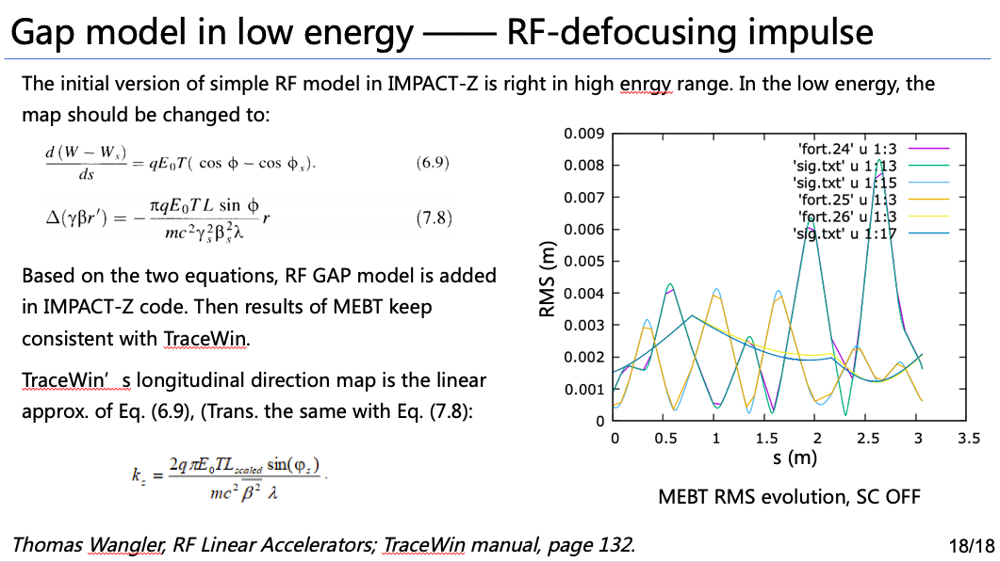

# lte2impactzin

# syntax

- `!` starts comments, comments following `!` are ignored.


- `&` 换行符

  ```bash
  D1: drift, &
      L=100   !comments here
  
  B1: Bend, angle=1.0, CSR=1, &  !comments here
      order=2
  ```

  ==First line is legal, fourth line is not legal.== `&` should be followed with `\n` character.

  

- element and line name should start with \[a-zA-Z]\[_]\[0-9]


- nested feature is surported

  ```
  D1: drift, &   ! comments here
  L=1.0
  
  B1: Bend,, angle="1.0"
  B2: Bend, angle=1.0
  B3: Bend, angle=1.0
  B4: Bend, angle=1.0
  
  BC: line=(B1,B2,B3,B4)
  
  BC-2: line=(2*BC)
  
  useline: line=(D1,2*BC-2)
  ```

- `,` and `;` are both supported in `beam` and `control` sections

  like:

  ```
  &beam
  	mass = 0.511;
  	Np = 1000;
  	charge = 1.0e-12;
  	sigx   = 0.1e-3,	sigxp  = 1.0e-3;  sigxxp = 0.0;	
  	sigy   = 0.1e-3;  sigyp  = 1.0e-3,  sigyyp= 0.0;
  	sigz  = 1.0e-3;   sigE = 1.0e3;     
  	chirp_h = 0.0;
  	
  	distribution_type = 45;
  &end
  ```

  

# code structure

- lattice_parser
- impactz_parser : lattice_parser
  - get_lattice_section
  - get_beam_section
  - get_control_section

- genimpactz


# lattice_parser

programing notes

- `N*FODO` case, how to expand it ?

  ```python
  #like, expand line=['4*FODO','BC1'] to ['FODO','FODO','FODO','FODO','BC1']
  
  line=['4*FODO','BC1']
  
  tmpline = []
  for item in line:
      if re.match(r'^\d+\*',item):    # 4*FODO case
          tmp = item.split('*')
          tmpline.extend( int(tmp[0]) * [tmp[1]])
  
      elif re.match(r'^[a-zA-Z]+\*',item):  # FODO*4 case
          tmp = item.split('*')
          tmpline.extend( int( tmp[1]) * [tmp[0]] )
          print('ATTENTION: If in Elegant, you should use N*FODO, not FODO*N in .lte file.')
  
      else:
          tmpline.append(item)
  line = tmpline
  ```


# impactz_parser

Right now, only add those parameters I used mostly and understood well. ==DO NOT add the parameters I have not tested yet.==


Code design methods:

-  If not in dict keys list, then set default values
-  not case sensitive, use upper to match element or parameters name
-  priority, if sentence


## control section

The values following are all default values.

```bash
&control
  core_num_T=1;
  core_num_L=1;
  
  integrator= 1;  
  
  meshx= 64;
  meshy= 64;
  meshz= 64;
 
  kinetic_energy= 0;       !kinetic energy [eV]
  default_order= 1;
  
  freq_rf_scale= 2.856e9;

  steps=1;    ! 1kicks/m
  maps=1      ! 1 map/half_step
  
	tsc=0;      !transverse space charge off
	lsc=0;      !longitudinal space charge off
	
	csr=0;      !csr off
	zwake=0;    !longitudinal wakefield off
	trwake=0;   !transverse wakefield off
	
	pipe_radius=0.014;  !pipe radius, [m]
	
	RingSimu=0;
	turn=1;  !for ring multi-turn simulation  
	n_turn_out=1; !every n_turn_out turn, WATCH element make outputs
	
	sample_out=1e5;  !WATCH element sample out how many particles
	                 !if Np<1e5, sample_out=Np
	slice_bin=128;   !slice bin for watch element
	
&end
```

- core_num_T, core_num_L, processor layout, the product of these numbers must equal the number of processors that you run on. 

- gridx, gridy, gridz, grid setting for PIC space charge simulation.

- default_order, 1 refers to linear map, 2 refers to nonlinear map for all elements. It has ==lower priority to the ORDER setted in each individual element==. 

- W [eV], kinetic_energy，即动能。注意与 ELEGANT 的 p_central_mev 区别开来：

  p_central_mev, 数值上即等于 $\gamma_0\beta_0$ [MeV/c], 即 $pc=\sqrt{\epsilon^2-\epsilon_0^2}=\gamma\beta m_0c^2=\sqrt{W^2+2W\epsilon_0}$

- f_scale, [Hz], scaling frequency.


| Parameter Name | Units | Type | Default | Description                                                  |
| -------------- | ----- | ---- | ------- | ------------------------------------------------------------ |
| integrator     |       | int  | 1       | 1 for linear map, i.e. transfer matrix; 2 for nonlinear Lorentz integrator. |
| steps          |       | int  | 1       | 1 kicks/m.                                                   |


### 新增一行

ImpactZ.in 中新增加了一行：

`Flagsc turn_number output_frequency SimuType`


1. space charge control:

- tsc=0, lsc=0: Flagsc=0
- tsc=0, lsc=1: Flagsc=1
- tsc=1, lsc=0: Flagsc=2
- tsc=1, lsc=1: Flagsc=3
- Flagsc=4, sc is OFF, however, csr or wake could be ON.

No need to set current being 0 for space charge OFF.


==To do==

- [x] If space charge OFF, but wakefield ON ?


2. turn_number

   Ring 的模拟圈数。`turn>1` 则认为是 ring simulation，不要利用该参数来重复 linac 的模拟次数。如果想像FODO 一样，$num \times FODO$ 来复制 lattice，应该在 lattice section 中使用 lattice 重复的特性。

​        

​       对于Linac 模拟，不要设置 `turn_number>1`，不然会引发错误。   

   

3. outfq

每多少圈 `watch` 元件有效。如`turn=5001`, `outfq=100`. Lattice 设置如下：

```
w0: watch, filename_ID=1000, sample_freq=1, slice_bin=20, slice_information=0, coordinate_convention="NORMAL"
line: line=(w0,cav0,RCS)
```

则会分别输出初始分布，100, 200, ..., 5000 圈后分布:

`fort.1000, fort.1100, fort.1200,...,fort.5000`.

turn 之所以设置 5001，是为了输出第5000圈之后的分布，所以故意多跑了一圈。


4. Ring or Linac simulation

In python level:

| Parameter Name | Units | Type | Default | Description                                                  |
| -------------- | ----- | ---- | ------- | ------------------------------------------------------------ |
| RingSimu       |       | int  | 0       | By default, ==Linac simulation is applied==. If RingSimu=1, then Ring simulation is applied. Mainly influence is at: phase folding, RF cavity frequency if based on $f_0$. |

In fortran level:

```
SimuType = 1 => Linac 
SimuType = 2 => Ring
```

对于 Linac 模拟，`freq_rf_scale` 可设置为 linac 频率，也可以不这么设置，仅仅是作为 scale 而存在的设置值。但对于 Ring 而言，因存在纵向的相位折叠，折叠时是相对于回旋周期而言的，因此 `fs=f0`，fs 应设置为回旋频率。当粒子速度逐圈变化时，`f0`会逐渐高于`fs`，此时，`fs` 不变，`f0`需要每圈重新计算。


## beam parameters

The listed values are default values if un-defined in input file.

```bash
&beam	
	mass   = 0.511e6;
	charge = -1.0;
	
	Np = 1000;
	total_charge = 1.0e-12;
	distribution_type = 45;
	
	! 因为 IMPACT-Z V2.0 中的 sigmax 并非 RMS “sigx”，仅当sigij=0时，两者相等。
	! 因此，不妨删除 sigij的设定，在python 中只能为0
	sigx  = 0.0;  ![m]
	sigxp = 0.0;  ![gambetx/gambet0]
	sigy  = 0.0;  ![m] 
	sigyp = 0.0;  ![gambety/gambet0]
	sigz  = 0.0;  ![m]
  sigdE  = 0.0;  ![eV] 
	
	! 当ij 有耦合时，必须用 twiss 参数给出分布
	! dispersion not support yet
  emit_nx = 0.0;
  emit_x = 0.0 ;
  beta_x = 1.0;
  alpha_x = 0.0;
  
  emit_ny = 0.0;
  emit_y = 0.0;
  beta_y = 1.0;
  alpha_y = 0.0;
  
  ! longitudinal, (z [deg], dE [MeV])
  ! 注意纵向 twiss 参数用的坐标单位与上面的 RMS 值单位不同
  emit_z = 0.0; ![deg MeV], 只有“几何”，不乘 gambet0
  beta_z = 1.0; ![deg/MeV]
  alpha_z= 0.0; ![1], so gamma_z [MeV/deg]
  
&end
```

- mass, [eV], for electron mass=0.511,  for proton mass=938.27e6.
- charge, for electron, charge=-1.0, for proton, charge=1.0
- total_charge, [C], if total_charge=0, space charge will be turned off.
- Np, particle number.
- sigx, sigy, sigz, beam RMS size [m].
- sigxp, sigyp, $sigxp=\gamma\beta_x/\gamma_0\beta_0$.
- sigE, [eV], beam RMS energy spread.


notes:

- Use EMATRIX to introduce energy chirp.

- If emit_x or emit_nx not equal to 0, then use twiss parameters for (x, px, y, py) distribution, otherwise, use sig values

- distribution_type, if equal to 19, read-in beam distribution, coordinate definition is ???
- mismatch, off-set not added yet


## lattice elements

```
&lattice
D1: drift, L=1.0
B1: Bend, angle=1.0
&end
```


If ORDER=0, i.e. not explicitly set in each ELEMENT, then the transfer map order is determined by DEFAULT_ORDER in control section.


### DRIFT

A drift space implemented as a linear matrix, or exactly drift map, see Wolski's book for more information.

| Parameter Name | Units | Type   | Default | Description                                                  |
| -------------- | ----- | ------ | ------- | ------------------------------------------------------------ |
| L              | m     | double | 0.0     | length of drift                                              |
| steps          |       | int    | 0       | 1 step means a half-drift + a space-charge kick + a half-drift |
| map_steps      |       | int    | 0       | each half-drift involves computing a map for that half-element, computed by numerical integration with 1 map_steps |
| order          |       | int    | 0       | 1 or 2, linear map or nonlinear map                          |
| pipe_radius    | m     | double | 0.0     | pip radius                                                   |

For space charge simulations, one should increase the steps number where beam size changes too much to meet the convergence. 


In fortran/ImpactZ.in level:

```
ID = -1, linear map

ID =0 or >0, nonlinear map.
```


### QUAD

A quadrupole implemented as a linear matrix or nonlinear map, see Wolski's book for more information.

| Parameter Name | Units       | Type   | Default | Description                                                  |
| -------------- | ----------- | ------ | ------- | ------------------------------------------------------------ |
| L              | m           | double | 0.0     | length                                                       |
| steps          |             | int    | 0       | how much section is divided into                             |
| map_steps      |             | int    | 0       | map steps                                                    |
| order          |             | int    | 0       | 1 or 2, linear map or nonlinear map; By default is 0, then `order` in control is used. |
| $K_1$          | $\rm{/m^2}$ | double | 0.0     | quadrupole strength, $K_1=\frac{1}{(B\rho)_0}\frac{\partial B_y}{\partial x}$ |
| grad           | T/m         | double | 0.0     | gradient $=\frac{\partial B_y}{\partial x}$, if `grad` value is non-zero, then `grad` is used. |
| pipe_radius    | m           | double | 0.0     | pip radius                                                   |
| Dx             | m           | double | 0.0     | x misalignment error                                         |
| Dy             | m           | double | 0.0     | y misalignment error                                         |
| rotate_x       | rad         | double | 0.0     | rotation error in x direction                                |
| rotate_y       | rad         | double | 0.0     | rotation error in y direction                                |
| ratate_z       | rad         | double | 0.0     | rotation error in y direction                                |


In ImpactZ.in, 不再保持与墙老师的 manual 兼容，ID>0 用来读rfdata 文件代号ID。

```
ID = -5, -15: (linear map, K1) and (nonlinear map, K1)
ID = -6, -16: (linear map, grad) and (nonlinear map, grad)
```


### BEND

A magnetic dipole implemented as a matrix, up to 2nd order. See K. Brown paper for more information.

| Parameter Name | Units        | Type   | Default | Description                                                  |
| -------------- | ------------ | ------ | ------- | ------------------------------------------------------------ |
| L              | m            | double | 0.0     | arc length                                                   |
| steps          |              | int    | 0       | how much section is divided into                             |
| map_steps      |              | int    | 0       | map steps                                                    |
| order          |              | int    | 0       | 1 or 2, linear map or nonlinear map                          |
| angle          | rad          | double | 0.0     | bend angle                                                   |
| E1             | rad          | double | 0.0     | entrance edge angle                                          |
| E2             | rad          | double | 0.0     | exit edge angle                                              |
| $K_1$          | $1\rm{/m^2}$ | double | 0.0     | quadrupole strength, $K_1=\frac{1}{(B\rho)_0}\frac{\partial B_y}{\partial x}$, not added yet in V2.1 version. |
| PIPE_RADIUS    | m            | double | 0.0     | half gap between poles                                       |
| h1             | 1/m          | double | 0.0     | entrance pole-face curvature                                 |
| h2             | 1/m          | double | 0.0     | exit pole-face curvature                                     |
| fint           |              | double | 0.0     | integrated fringe field                                      |
| Dx             | m            | double | 0.0     | x misalignment error                                         |
| Dy             | m            | double | 0.0     | y misalignment error                                         |
| rotate_x       | rad          | double | 0.0     | rotation error in x direction                                |
| rotate_y       | rad          | double | 0.0     | rotation error in y direction                                |
| ratate_z       | rad          | double | 0.0     | rotation error in y direction                                |
| CSR            |              | int    | 0       | 0/1, whether to include 1D-CSR effects or not.               |


Error parameters of Dx, Dy, rotate_x, rotate_y, rotate_z are added in version-2.1.

Elegant fint is set 0.5 as default value.


### EMATRIX

Kick particles use given transfer matrix. Currently only support (m11,m33,m55,m56,m65).

| Parameter Name | Units | Type   | Default | Description                                                  |
| -------------- | ----- | ------ | ------- | ------------------------------------------------------------ |
| PIPE_RADIUS    |       | double | 0.0     | un-used                                                      |
| R11            |       | double | 1.0     | for x direction shrink                                       |
| R33            |       | double | 1.0     | for y direction shrink.                                      |
| R55            |       | double | 1.0     | for z direction shrink                                       |
| R56            |       | double | 0.0     | momentum compaction factor, because we used z>0 for beam head, so positive m56 results bunch length compression in four dipole chicane. |
| R65            |       | double | 0.0     | for energy chirp, R65<0 for chicane compression, R65>0 for de-chirp. |
| R66            |       | double | 1.0     |                                                              |
| T566           |       | double | 0.0     |                                                              |
| T655           |       | double | 0.0     | i.e. $\delta=az+bz^2$,  $T_{655}=b$                          |


### RFCW

RF cavity with exact phase dependence. Model is drift + acceleration momentum kick + drift.

| Parameter Name | Units  | Type   | Default | Description                                                  |
| -------------- | ------ | ------ | ------- | ------------------------------------------------------------ |
| L              | m      | double | 0.0     | length                                                       |
| steps          |        | int    | 0       | steps                                                        |
| map_steps      |        | int    | 0       | map steps                                                    |
| order          |        | int    | 0       | 1 or 2, linear map or nonlinear map                          |
| volt           | V      | double | 0.0     | peak voltage                                                 |
| gradient       | V/m    | double | 0.0     | peak acceleration gradient, ==volt has priority if both volt and gradient are given==. |
| phase          | degree | double | 0.0     | driven phase,  sin() function is used (same as ELEGANT, different with IMPACT-Z), $E_z=A\cdot \rm{sin}(kz+\phi)$, phase=90 is the crest for acceleration |
| freq           | Hz     | double | 2.856e9 | RF frequency                                                 |
| end_focus      |        | int    | 1       | turn ON or OFF cavity end focus effects. 0 for OFF, 1 for ON. |
| pipe_radius    | m      | double | 0.0     | pip radius                                                   |
| Dx             | m      | double | 0.0     | x misalignment error                                         |
| Dy             | m      | double | 0.0     | y misalignment error                                         |
| rotate_x       | rad    | double | 0.0     | rotation error in x direction                                |
| rotate_y       | rad    | double | 0.0     | rotation error in y direction                                |
| ratate_z       | rad    | double | 0.0     | rotation error in z direction                                |
| zwake          |        | int    | 0       | 0/1, if zero, longitudinal wake is turned off                |
| trwake         |        | int    | 0       | 0/1, if zero, transverse wakes are turned off                |
| wakefile_ID    |        | int    | None    | If  WAKEFIEL_ID=41, it refers to `rfdata41.in` , which contains RF structure wakefield, 1st column is s [m],  2nd column is longitudinal wakefield $w_L$ [V/C/m], 3rd column is transverse wakefield $w_T$ [$\rm{V/C/m^2}$]. |
| ac_mode        |        | int    | 0       | for RCS AC mode, if equal 1, then rfdata_ac.in should be given. And NONLINEAR map will be called, order=1 will be overwritten. |

rfdata_ac.in::q:

```
line_number harmonic number

col 1: time (s)

col 2: brho (T m), not used in IMPACT-Z, 0 is also OK

col 3: voltage (GV)

col 4: phase (degree), sin function, changed to cos in math.f90
```

In IMPACT-Z source code: 

​		ac_mode=1, end focus, ID=-0.55

​        ac_mode=1, NO end focus, ID=-0.65  


### WAKEON and WAKEOFF

This is for test the wakefield, where we put the drift between the wake ON and OFF elements.

```bash
!usage:
wake1: wakeon,  wakefile_ID=41
wake2: wakeoff, wakefile_ID=41
d1: drfit, L=100

line: line=(wake1,d1,wake2)
```


| Parameter Name | Units | Type | Default | Description                                                  |
| -------------- | ----- | ---- | ------- | ------------------------------------------------------------ |
| zwake          |       | int  | 0       | 0/1, if zero, longitudinal wake is turned off                |
| trwake         |       | int  | 0       | 0/1, if zero, transverse wakes are turned off                |
| wakefile_ID    |       | int  | None    | If  WAKEFIEL_ID=41, it refers to `rfdata41.in` , which contains RF structure wakefield, 1st column is s [m],  2nd column is longitudinal wakefield $w_L$ [V/C/m], 3rd column is transverse wakefield $w_T$ [$\rm{V/C/m^2}$]. |


### WATCH

```bash
w0: watch, filename_ID=1000

#with the default settings in the control section, the line equals:
w0: watch, filename_ID=1000, sample_freq = ceil(Np/1e5), slice_bin=128
```


Output particle distribution and beam slice information into fort.N and fort.(N+1e4) files, where N is the filename_ID. 

| Parameter Name        | Units | Type   | Default | Description                                                  |
| --------------------- | ----- | ------ | ------- | ------------------------------------------------------------ |
| filename_ID           |       | int    | 1000    | number larger than 1000 is recommended                       |
| sample_freq           |       | int    | 0       | If sample_freq=10, every 10 particles output 1 particle. If not set (`sample_freq=0`), `sample_out` in control section will set the `sample_freq` based on the `Np` particle number. |
| coordinate_convention |       | string | normal  | 'NORMAL' or 'IMPACT-Z'                                       |
| slice_information     |       | int    | 1       | whether output slice information, i.e. whether add -8 element simultaneously |
| slice_bin             |       | int    | 0       | bins number for getting histogram slice information. If not set (`slice_bin=0`), `slice_bin` in control section will set the value. |

If  coordinate_convention='normal', output phase space is $(x,\gamma\beta_x,y,\gamma\beta_y,t,\gamma)$, where $x,y,t$ are in .  For coordinate_convention='IMPACT-Z', output phase space is $(xw/c,\gamma\beta_x,yw/c,\gamma\beta_y,wt,-(\gamma-\gamma_0))$,  where $w$ is $w=2\pi f$, $f$ is the scaling frequency.

If filename_ID = 1001, then the output file would be fort.1001 and fort.6001. fort.6001 refers to ImpactZ -8 element output file (+5000), which outputs slice information. The columns in this file are as following:

| Column number | Units | Description                                |
| ------------- | ----- | ------------------------------------------ |
| 1             | m     | bunch length                               |
| 2             |       | particle number per slice                  |
| 3             | A     | current per slice                          |
| 4             | mrad  | x-direction normalized emittance per slice |
| 5             | mrad  | y-direction normalized emittance per slice |
| 6             |       | relative energy spread, dE/E per slice     |
| 7             | eV    | uncorrelated energy spread per slice       |
| 8             | m     | $<x>$                                      |
| 9             | m     | $<y>$                                      |
| 10            |       | x-direction mismatch factor ???            |
| 11            |       | y-direction mismatch factor ???            |

==To do:==

Use `coordinate_convention` to output different coordinate:

- (x, gambetx/gambet0, y, gambety/gambet0, z, delta)
- (x, gambetx, y, gambety, z, dgam)


### SHIFTCENTER

Shift the beam center to the origin point for 6-direction coordinates.

```
elem1: shiftcenter, L=0;
```

In order to keep the format consistence with other elements (for re expression),  `L=0` must be added.


The original `0 0 0 -1`  only shift transverse coordinates, now 6D shift.

==question:== Then what's `-21` elements used for?


### RingRF

BPM type element, zero length. Thin cavity model applied in Ring simulation, both DC and AC model.

In ImpactZ.in file, -42 element is added:

```bash 
0 0 0 -42 radius(m) volt(eV) harmNum phase(degree) flag
```

where `flag` is used for option `AC or DC model`.

```
flag=1, DC, default value
flag=2, AC
```


For python level:

```
cav0: RingRF,radius= ,
```

| Parameter Name | Units  | Type   | Default | Description                                                  |
| -------------- | ------ | ------ | ------- | ------------------------------------------------------------ |
| volt           | V      | double | 0.0     | peak voltage                                                 |
| phase          | degree | double | 0.0     | driven phase,  sin() function is used (same as ELEGANT, different with IMPACT-Z), $E_z=A\cdot \rm{sin}(kz+\phi)$, phase=90 is the crest for acceleration。Automatic change to cos func when generate Impactz.in |
| harm           |        | int    | 1       | harmonic number, $f_{RF}=harm\times f_{0}$                   |
| pipe_radius    | m      | double | 0.0     | pip radius, not used yet                                     |
| ac_mode        |        | int    | 0       | default is DC model. For RCS AC mode, if equal 1, then `rfdata_ac.in` file should be given. And NONLINEAR map will be called. |

rfdata_ac.in:

```bash
line_number harmonic_number

col 1: time (s)

col 2: brho (T m), not used in IMPACT-Z, 0 is also OK

col 3: voltage (GV)

col 4: phase (degree), sin function, auto changed to cos in math.f90
```


如何做到 RF curve 文件只读取一次：

只在第一次遇到时读取文件，最后 deallocate 即可。


### GAP

BPM type element, zero length. GAP model for low energy beam.

In ImpactZ.in file, -43 element is added:

```bash 
0 0 0 -43 radius(m) volt(eV) freq phase(degree) /
```

IMPACT-Z use cos convention.


For python level:

```
rfgap: gap, radius= 18e-3, volt=124831, freq=324e6, phase=0

```

In python level, sin convention is applied.


| Parameter Name | Units  | Type   | Default | Description                                                  |
| -------------- | ------ | ------ | ------- | ------------------------------------------------------------ |
| volt           | V      | double | 0.0     | peak voltage                                                 |
| phase          | degree | double | 0.0     | driven phase,  sin() function is used (same as ELEGANT, different with IMPACT-Z), $E_z=A\cdot \rm{sin}(kz+\phi)$, phase=90 is the crest for acceleration。Automatic change to cos func when generate Impactz.in |
| freq           | Hz     | double | 324e6   | RF frequency                                                 |
| pipe_radius    | m      | double | 0.0     | pip radius, not used yet                                     |


 


# data process

## fort.24 & fort.25

Add 4 additional columns data output:

| 8     | 9      | 10   | 11    | 12   |
| ----- | ------ | ---- | ----- | ---- |
| betax | gammax | etax | etaxp | turn |

## fort.18

7th col: time(s)

8th col: brho (T m)

9th col: turn


## -8 元件

增加 对于 dE 的统计直方图


# to do

- [ ] sc off, wake on
- [ ] AC模式下，文件只读取一次
- [ ] 


- default order in control section should control all settings in lattice, lower priority than ORDER in each element.
- ~~total_charge=0, turn off space charge~~.
- ~~add a charge=1.0/-1.0 parameter.~~
- how to keep charge and current when space charge is off.
- rpn expression in lattice section is not supported yet.
- ~~comment "!" is not supported in beam and control section.~~
- 增加对 MARK 元件的支持，增加一个 class 支持 elegant 元件的直接转换


- 赋值功能

  

  已添加。


- [ ] elegant2impactz.py

  read in elegant .lte type lattice, convert it to ImpactZ.in.

  convention:

  - lte file is not case sensitive, both  `drift` and `DRIFT` are supported.


# 2. Fortran level

use ID flag to control elements behavior

use ID flag to choose linear or nonlinear map, to control collective effects behavior.

## quad

- (-10,0),        linear map, recommend using ID=-5
- less than -10,  nonlinear map, recommend using ID=-15

<br/>usage:

quad length=0.3, steps=1, map steps=1, K1=-4, ID=-5, radius=0.014 

0.30 1 1 1 -4 -5 0.014 0 0 0 0 0 /

## dipole

- (0,50),         linear map, ID=25
- (50,100),       linear map + csr, ID=75
- (100,200),      nonlinear map, recommend using ID=150
- \>200,          nonlinear map + CSR, recommend using ID=250

<br/>usage: ID=25

0.200000 1 1 4 1.105843492438955e-01 0 25 1.0 0.000000000000000e+00 1.105843492438955e-01 0 0 0 /

## drift

add an addition parameter for ID flag.

- ID<0, linear map, ID=-1
- otherwise, real map, ID left ungiven use real map.

<br/>usage:ID=-1

10 1 1 0 1.0 -1 /

## 103 cavity

when ID<0, the 103 element use simple sinusoidal RF cavity model. Parameters following 103 is different from manual.

- -0.5,           linear map
- -1.0,           nonlinear map for middle drift and end focus, drift using individual particle informations.

<br/>usage:ID=-0.5 

acceleration gradient=5.97474936319844610989e+06 V/m, frequency=1.3e9 Hz, phase=-30 degree, ID=-0.5 use linear map

1.0 1 1 103     5.97474936319844610989e+06     1.3e+09    -30 -0.5 1.0 /

## space charge 

current in 11th line of ImpactZ.in file:

- current=0, off 
- current .ne. 0, on

## -41 element, read-in RF cavity structure wakefield

this element should be used in pair, turn on in previous of 103 cavity element, and turn off after 103 cavity.

- ID=-1, turn OFF
- ID=(0,10), only Lwake, ID=5
- ID=(10,20), only Twake, ID=15
- ID\>20, Lwake + Twake, ID=25

<br/>usage: ID=15, ID=-1

add structure wakefield (given in rfdata41.in file) for 103 cavity, and only turn ON Twake

0 0 1 -41 1.0 41 15 /

1.0 1 1 103     5.97474936319844610989e+06     1.3e+09    -30 -0.5 1.0 /

0 0 1 -41 1.0 41 -1 / 

# add new distribution type

- type 45, cylinder uniform distribution based on pseudorandom number, gaussian distribution of momentum.

- type 46, cylinder uniform distribution with sinusoidal density modulation, based on halton sequence, gaussian distribution of momentum.
  - alphaxyz=0, which means alpha value settings in 8th-10th lines are ignored, and also: mismatch=1 and offset=0
  - offsetPhase and offsetEnergy are used as (eta,lambda), eta is density modulation depth, lambda is wavelength (m)
  - no gaussian end distribution added yet

# how to compile IMPACT-Z to parallel version

- comment out the line "use mpistub" in Contrl/Input.f90, DataStruct/Data.f90,
  DataStruct/Pgrid.f90, DataStruct/PhysConst.f90, and Func/Timer.f90.
- remove the mpif.h file under the Appl, Control, DataStruct, and Func directories.
- delete mpistub.o in the Makefile
- use the appropriate parallel fortran compiler such as mpif90.


# Debug

## 回溯问题

对于RCS 长束团而言，横向的一级回溯需要 comment 掉：

==注意：只改动了 open3D 的SC 算法，对于其他SC边界条件，没有修改。==


```fortran
1397               call cvbkforth1st_BeamBunch(Bpts)
```

横向漂回去，在哪里？

```fortran
1653         subroutine cvbkforth1st_BeamBunch(this)
1654         implicit none
1655         include 'mpif.h'
1656         type (BeamBunch), intent(inout) :: this
1657         integer :: i
1658         double precision :: gamma0,xk,xl
1659         double precision :: rcpgammai,betai,beta
1660
1661         xl = Scxl
1662         xk = 1/xl
1663
1664         gamma0 = -this%refptcl(6)
1665         beta = sqrt(gamma0*gamma0 - 1.0)/gamma0
1666
1667         do i = 1, this%Nptlocal
1668           rcpgammai = 1.0/(-this%Pts1(6,i)+gamma0)
1669           betai = sqrt(1.0-rcpgammai*rcpgammai*(1+this%Pts1(2,i)**2+ &
1670                                             this%Pts1(4,i)**2) )
1671           this%Pts1(5,i) = this%Pts1(5,i)*xk/(-gamma0*betai)
1672           this%Pts1(1,i) = this%Pts1(1,i)*xk
1673           this%Pts1(3,i) = this%Pts1(3,i)*xk
1674         enddo
1675
1676         do i = 1, this%Nptlocal
1677           rcpgammai = 1.0/(-this%Pts1(6,i)+gamma0)
1678           betai = sqrt(1.0-rcpgammai*rcpgammai*(1+this%Pts1(2,i)**2+ &
1679                        this%Pts1(4,i)**2) )
1680           this%Pts1(1,i) = this%Pts1(1,i)*xl
1681           this%Pts1(3,i) = this%Pts1(3,i)*xl
1682           this%Pts1(5,i) = -gamma0*betai*this%Pts1(5,i)*xl
1683         enddo
1684
1685         end subroutine cvbkforth1st_BeamBunch
```


真正由 z-frame => t-frame 后，由 t-frame => z-frame 的在：

```fortran
!Accsimulator.f90

! transform from z-frame to t-frame
1115               call conv1st_BeamBunch(Bpts,tau2,Nplocal,Np,ptrange,&              

...

! transform back from t-fram to z-frame
!--------------------------------------
!coment it, then 0thcv
1397               call cvbkforth1st_BeamBunch(Bpts)

! It is in Accsimulator.f90/kick1wake_BeamBunch and map2_BeamBunch
1415             if(Flagmap.eq.1) then
1416             ! kick particles in velocity space.
1417               if((flagwake.eq.1) .or. (flagcsr.eq.1)) then
1418                 !biaobin, if Potential%FieldQ = 0.0d0, i.e. potential
1419                 !from space charge is set to 0, space charge is OFF.
1420                 !Potential%FieldQ = 0.0d0 !test wakefield
1421                 call kick1wake_BeamBunch(Bpts,tau2,Nxlocal,Nylocal,Nzlocal,&
1422                    Potential%FieldQ,Ageom,grid2d,Flagbc,Perdlen,exwake,eywake,&
1423                    ezwake,Nz,npx,npy,Flagsc)
1424               else
1425                 !biaobin, 21-09-01
1426                 !for drift, quad elements, no wake and csr, comes here
1427                 !If want to consider Lwake only, SC OFF, Field=0 should
1428                 !also set here
1429                 !Potential%FieldQ = 0.0d0 !test wakefield
1430                 call map2_BeamBunch(Bpts,tau2,Nxlocal,Nylocal,Nzlocal,&
1431                    Potential%FieldQ,Ageom,grid2d,Flagbc,Perdlen,Flagsc)
1432               endif

! scatter1_BeamBunch()
! 只是坐标变换这里，但注意用的是 betai=betaz
2182           rays(1,n) = rays(1,n)*xk                  !X=x*xk
2183           rays(2,n) = rays(2,n)+tau*xycon*exn
2184           rays(3,n) = rays(3,n)*xk                  !Y=y*xk
2185           rays(4,n) = rays(4,n)+tau*xycon*eyn
2186           rays(5,n) = rays(5,n)*xk/(-gam*betai)     !T=z*xk/(-gam0*betz), gam0 is    
                                                         !beam-frame => lab-frame
2187           rays(6,n) = rays(6,n)-tau*tcon*ezn
2188         enddo
2189
2190         t_ntrslo = t_ntrslo + elapsedtime_Timer( t0 )
2191
2192         end subroutine scatter1_BeamBunch

```


